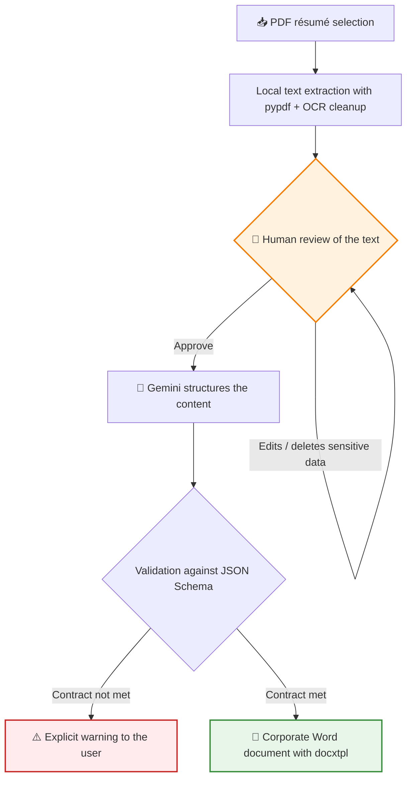
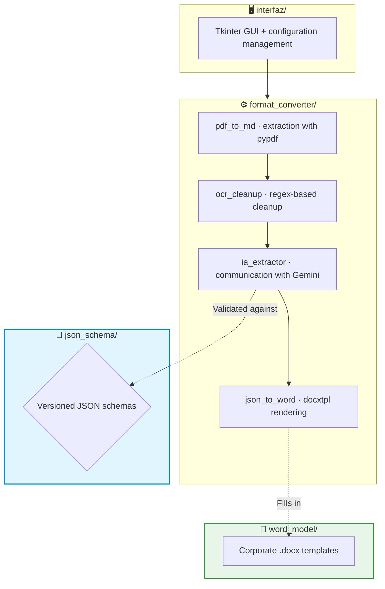

# 📄 Showcase: CV Auto Processor — From a PDF résumé to a corporate Word document

This project is a desktop application that automates a highly repetitive HR task: turning résumés received as PDFs into the corporate Word template. The application reads the PDF, structures its content with generative AI (Google Gemini) and delivers the final, already formatted document — with a human review step before any data leaves the machine.

> [!NOTE]
> **Confidentiality Notice**
> As this is a project developed for a company, certain internal details, specific prompts and parts of the code are protected by confidentiality. However, in this document I explain in broad terms the main structure and how the application works.

## 🔎 What does the application do?

Before this tool, every incoming résumé had to be read, its experience, education and skills transcribed by hand, and everything copied into the Word template while taking care of the formatting: minutes (sometimes hours) per candidate, with transcription errors that were hard to spot.

With the application, the flow comes down to **three steps**: select the PDF, review the extracted text and generate the Word document. The result is saved next to the original PDF, ready for any final touch-ups.

A key design point is **privacy**: the PDF file is never sent anywhere. Text extraction happens 100 % locally, and the only thing that travels to the AI API is the text the person has already reviewed on screen — with the option to delete any sensitive data beforehand.

## 🔄 Workflow

The human review step is not cosmetic: it is the control point where sensitive data is removed before anything leaves the machine. Deciding what the AI gets to see is always up to the person, not the program.

## 🏗️ Project Architecture

I designed the application in a modular way, separating the interface, the conversion pipeline and the data contract:

1. 🖥️ **Interface (`interfaz/`)**: the desktop GUI (Tkinter) with the complete flow: PDF selection, review editor, model selector and generation. The GUI orchestrates, but holds no business logic.
2. ⚙️ **Conversion pipeline (`format_converter/`)**: a chain of independent modules where each link has a single responsibility — extract, clean, structure with AI and render. Every piece can evolve separately.
3. 📐 **Data contract (`json_schema/`)**: versioned JSON schemas that define exactly what structure the LLM must return. It is the formal border between the probabilistic world (the AI) and the deterministic one (the document).
4. 🎨 **Templates (`word_model/`)**: the visual identity lives in `.docx` templates with placeholders, outside the code. Changing the corporate branding does not require touching a single line of Python.

## ✨ Technical Highlights

*   📐 **JSON Schema as a contract with the LLM**: the model's output is validated against a strict schema before it touches the Word document. That way a probabilistic model becomes a deterministic piece of the pipeline: either the response meets the contract, or it fails explicitly — it never silently produces a corrupt document.
*   🔒 **100 % local text extraction**: the PDF is processed on the machine with **pypdf**, including a cleanup step for artefacts typical of scanned documents (OCR) using regular expressions. Only already-reviewed plain text travels to the API: less exposure surface for personal data and fewer billed tokens.
*   👤 **Human-in-the-loop before the API**: the user sees and edits all the extracted text before sending it to the AI. It is the compliance guarantee built into the design: the decision to expose data is explicit and human.
*   ⚡ **Selectable Flash models**: the interface lets you choose between several models of the Gemini Flash family, tuning the quality-cost-speed balance according to the batch of résumés to process.
*   📦 **Frictionless distribution**: it is packaged with PyInstaller as a self-contained executable (`.exe`). The end user installs nothing and needs no technical knowledge: double click and two buttons.
*   🗂️ **Process traceability**: for every résumé, three artefacts are persisted next to the original PDF — the validated JSON, the text structured by the AI and the final Word document — in case any step needs to be audited or reviewed.

## 🚀 Project Status

It is a functional prototype in use, and the lightest of the applications in the portfolio (~700 lines): a focused pipeline that does one thing and does it well. It has been through several version iterations, already packaged and distributed as an executable. The natural next steps are adding an automated test suite for the pipeline, hardening the handling of API errors and allowing batches of résumés to be processed in a single pass.

---

**Iván Herrero - AI & Automation Specialist**
