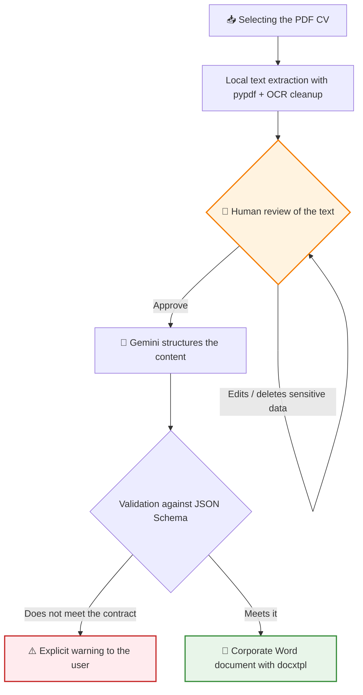

# 📄 Showcase: CV Auto Processor — From a PDF CV to a corporate Word document


This project is a desktop application that automates a very repetitive HR task: moving CVs received as PDFs into the corporate Word template. The application reads the PDF, structures its content with generative AI (Google Gemini) and delivers the final, already formatted document — with a human review step before any data leaves the computer.

> [!NOTE]
> **Confidentiality Notice**
> Since this project was developed for a company, certain internal details, specific prompts and parts of the code are protected by confidentiality. However, in this document I explain in broad terms the main structure and how the application works.

## 🔎 What does the application do?

Before this tool, every CV received had to be read, its experience, education and skills transcribed by hand, and everything copied into the Word template while taking care of the formatting: minutes (sometimes hours) per candidate, with transcription errors that were hard to spot.

With the application, the flow is reduced to **three steps**: select the PDF, review the extracted text and generate the Word document. The result is saved next to the original PDF, ready to be touched up if needed.

A key point of the design is **privacy**: the PDF file is never sent anywhere. Text extraction is done 100% locally, and the only thing that travels to the AI API is the text the person has already reviewed on screen — with the option to delete any sensitive data beforehand.

## 🔄 Workflow



The human review step is not cosmetic: it is the checkpoint where sensitive data is removed before anything leaves the computer. The decision about what the AI sees always belongs to the person, not the program.

## 🏗️ Project Architecture

I designed the application in a modular way, separating the interface, the conversion pipeline and the data contract:


1. 🖥️ **Interface (`interfaz/`)**: the desktop GUI (Tkinter) with the complete flow: PDF selection, review editor, model selector and generation. The GUI orchestrates, but contains no business logic.
2. ⚙️ **Conversion pipeline (`format_converter/`)**: a chain of independent modules where each link has a single responsibility — extract, clean, structure with AI and render. Each piece can evolve separately.
3. 📐 **Data contract (`json_schema/`)**: versioned JSON schemas that define exactly what structure the LLM must return. It is the formal boundary between the probabilistic world (the AI) and the deterministic one (the document).
4. 🎨 **Templates (`word_model/`)**: the visual identity lives in `.docx` templates with placeholders, outside the code. Changing the corporate image does not require touching a single line of Python.

## ✨ Key Technical Features

*   📐 **JSON Schema as a contract with the LLM**: the model's output is validated against a strict schema before touching the Word document. This way, a probabilistic model becomes a deterministic piece of the pipeline: either the response meets the contract, or it fails explicitly — it never silently generates a corrupt document.
*   🔒 **100% local text extraction**: the PDF is processed on the computer with **pypdf**, with a cleanup step for typical artifacts of scanned documents (OCR) using regular expressions. Only already-reviewed plain text travels to the API: less exposure surface for personal data and fewer billed tokens.
*   👤 **Human-in-the-loop before the API**: the user sees and edits all the extracted text before sending it to the AI. It is the design's compliance guarantee: the decision about data exposure is explicit and human.
*   🧠 **Prompt with business rules**: the prompt forces the model to return only JSON (and the code still strips the ```` ``` ```` blocks if the model adds them), uses `null` instead of inventing data, translates any CV into Spanish whatever its language, normalizes text written in CAPITAL LETTERS while respecting acronyms (SQL, AWS…) and treats the CV content as data, not as instructions (basic defense against *prompt injection*).
*   ⚡ **Selectable Flash models**: the interface lets you choose between several models of the Gemini Flash family (Gemini 3.5 Flash by default, 2.5 Flash and 3 Flash Preview). The choice was validated with real use: the *Flash-Lite* variant was removed in v1.3.1 because its quality did not meet HR's needs.
*   🧵 **An interface that does not freeze**: the AI call runs in a secondary thread and the result returns to the Tkinter thread with `root.after()`. While processing, the controls are locked to prevent double submissions.
*   🔑 **Persistent per-user API Key**: the key is stored in the user's profile (`~/.cv_auto_processor/config.json`), not inside the executable, and as an alternative it is read from `GEMINI_API_KEY` in the `.env`. It is entered once and the `.exe` remains the same for the whole team.
*   📦 **Frictionless distribution**: it is packaged with PyInstaller as a self-contained executable (`.exe`) that includes schemas, templates and an HTML report with the project status, accessible from the app itself. The end user installs nothing and needs no technical knowledge.
*   🧹 **Data minimization**: all that remains from the process is the final Word document next to the original PDF. The intermediate JSON is a temporary file that is deleted once the document has been generated; the first versions also saved the AI's JSON and Markdown for debugging, but they were removed in v1.0.1 so as not to leave loose copies of personal data.

## 🚀 Project Status

It is a functional prototype in use, and the lightest of the applications in the portfolio (~700 lines): a focused pipeline that does one thing and does it well. It has evolved based on HR feedback through versions packaged as an executable, from v1.0 to **v1.3.1**: adjustments to the Word layout (profile, languages and availability within *Knowledge and Skills*), persistent storage of the API Key, *prompt engineering* to match the user's guidelines and model selection based on real results. The natural next steps are to add a suite of automated tests for the pipeline, harden API error handling and allow processing batches of CVs in a single pass.

---

**Iván Herrero - AI & Automation Specialist**
