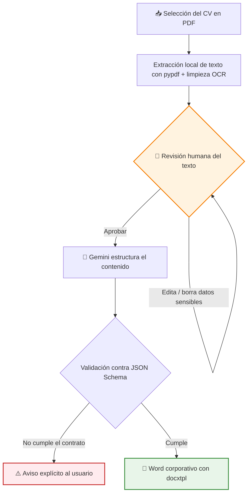
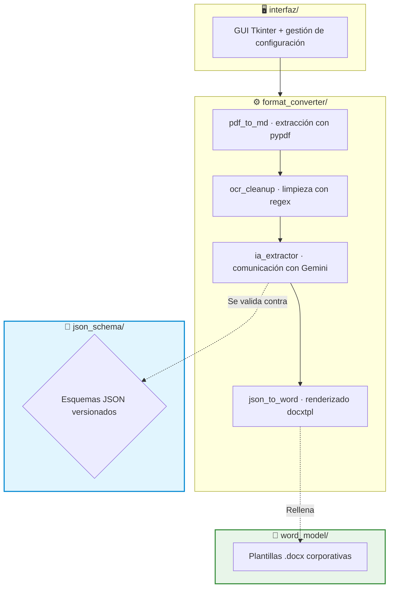

# 📄 Showcase: CV Auto Processor — De un CV en PDF a un Word corporativo

Este proyecto es una aplicación de escritorio que automatiza una tarea muy repetitiva de RRHH: pasar currículums recibidos en PDF a la plantilla corporativa de Word. La aplicación lee el PDF, estructura su contenido con IA generativa (Google Gemini) y entrega el documento final ya maquetado — con un paso de revisión humana antes de que ningún dato salga del equipo.

> [!NOTE]
> **Aviso de Confidencialidad**
> Como es un proyecto desarrollado para una empresa, ciertos detalles internos, prompts específicos y partes del código están protegidos por confidencialidad. Sin embargo, en este documento explico a grandes rasgos la estructura principal y cómo funciona la aplicación.

## 🔎 ¿Qué hace la aplicación?

Antes de esta herramienta, cada CV recibido había que leerlo, transcribir a mano la experiencia, formación y habilidades, y copiarlo todo a la plantilla de Word cuidando el formato: minutos (a veces horas) por candidato, con errores de transcripción difíciles de detectar.

Con la aplicación, el flujo se reduce a **tres pasos**: seleccionar el PDF, revisar el texto extraído y generar el Word. El resultado queda guardado junto al PDF original, listo para retocar si hace falta.

Un punto clave del diseño es la **privacidad**: el archivo PDF nunca se envía a ningún sitio. La extracción de texto se hace 100 % en local, y lo único que viaja a la API de IA es el texto que la persona ya ha revisado en pantalla — pudiendo borrar antes cualquier dato sensible.

## 🔄 Flujo de trabajo

El paso de revisión humana no es cosmético: es el punto de control donde se eliminan datos sensibles antes de que nada salga del equipo. La decisión de qué ve la IA es siempre de la persona, no del programa.

## 🏗️ Arquitectura del Proyecto

Diseñé la aplicación de forma modular, separando la interfaz, el pipeline de conversión y el contrato de datos:

1. 🖥️ **Interfaz (`interfaz/`)**: la GUI de escritorio (Tkinter) con el flujo completo: selección de PDF, editor de revisión, selector de modelo y generación. La GUI orquesta, pero no contiene lógica de negocio.
2. ⚙️ **Pipeline de conversión (`format_converter/`)**: una cadena de módulos independientes donde cada eslabón tiene una única responsabilidad — extraer, limpiar, estructurar con IA y renderizar. Cada pieza puede evolucionar por separado.
3. 📐 **Contrato de datos (`json_schema/`)**: esquemas JSON versionados que definen exactamente qué estructura debe devolver el LLM. Es la frontera formal entre el mundo probabilístico (la IA) y el determinista (el documento).
4. 🎨 **Plantillas (`word_model/`)**: la identidad visual vive en plantillas `.docx` con placeholders, fuera del código. Cambiar la imagen corporativa no requiere tocar una línea de Python.

## ✨ Características Técnicas Destacadas

*   📐 **JSON Schema como contrato con el LLM**: la salida del modelo se valida contra un esquema estricto antes de tocar el Word. Así, un modelo probabilístico se convierte en una pieza determinista del pipeline: o la respuesta cumple el contrato, o falla de forma explícita — nunca genera un documento corrupto en silencio.
*   🔒 **Extracción de texto 100 % local**: el PDF se procesa en el equipo con **pypdf**, con un paso de limpieza de artefactos típicos de documentos escaneados (OCR) mediante expresiones regulares. A la API solo viaja texto plano ya revisado: menos superficie de exposición de datos personales y menos tokens facturados.
*   👤 **Human-in-the-loop antes de la API**: el usuario ve y edita todo el texto extraído antes de enviarlo a la IA. Es la garantía de cumplimiento del diseño: la decisión de exposición de datos es explícita y humana.
*   ⚡ **Modelos Flash seleccionables**: la interfaz permite elegir entre varios modelos de la familia Gemini Flash, ajustando el equilibrio calidad-coste-velocidad según el lote de CVs a procesar.
*   📦 **Distribución sin fricción**: se empaqueta con PyInstaller como un ejecutable autocontenido (`.exe`). El usuario final no instala nada ni necesita conocimientos técnicos: doble clic y dos botones.
*   🗂️ **Trazabilidad del proceso**: por cada CV se persisten tres artefactos junto al PDF original — el JSON validado, el texto estructurado por la IA y el Word final — por si hay que auditar o consultar cualquier paso.

## 🚀 Estado del Proyecto

Es un prototipo funcional en uso, y la más ligera de las aplicaciones del portfolio (~700 líneas): un pipeline enfocado que hace una cosa y la hace bien. Ha pasado por varias iteraciones de versión ya empaquetadas y distribuidas como ejecutable. Los siguientes pasos naturales son añadir una suite de tests automatizados del pipeline, endurecer el manejo de errores de la API y permitir procesar lotes de CVs en una sola pasada.

---

**Iván Herrero - AI & Automation Specialist**